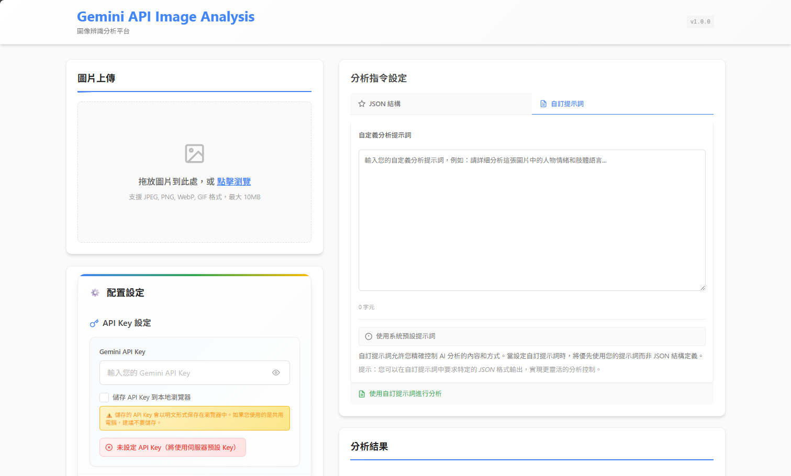

# 🖼️ AI 圖像分析 API

[](https://opensource.org/licenses/MIT)
[](https://nodejs.org/)
[](https://reactjs.org/)
[](https://ai.google.dev/)

基於 **Gemini Pro 2.5 API** 的智能圖像分析應用程式，提供強大的多模態 AI 能力。使用者可以上傳圖片並指定所需的 JSON 結構，系統將自動分析圖像內容並回傳結構化的 JSON 資料。



## ✨ 主要功能

- 🔍 **智能圖像分析** - 使用 Google Gemini Pro 2.5 進行深度圖像理解
- 📝 **自訂 JSON 結構** - 指定輸出格式，獲取結構化資料
- 🖼️ **多格式支援** - 支援 JPEG、PNG、WebP、GIF 等格式
- 🚀 **即時處理** - 快速回應和處理圖像請求
- 🔒 **安全可靠** - 內建速率限制和安全中介軟體
- 📱 **響應式設計** - 現代化的使用者介面
- 🐳 **容器化部署** - 支援 Docker 一鍵部署

## 📋 目錄

- [技術堆疊](#-技術堆疊)
- [專案結構](#-專案結構)
- [快速開始](#-快速開始)
- [API 文件](#-api-文件)
- [環境變數](#-環境變數)
- [開發指令](#-開發指令)
- [Docker 部署](#-docker-部署)
- [支援格式](#-支援格式)
- [API Key 設置](#-api-key-設置)
- [故障排除](#-故障排除)
- [貢獻指南](#-貢獻指南)
- [授權條款](#-授權條款)

## 🛠️ 技術堆疊

### 前端
- **React 19.1.0** - 現代化的前端框架
- **Vite 7.0.4** - 快速的建置工具
- **React Dropzone** - 拖拽上傳功能
- **Axios** - HTTP 客戶端

### 後端
- **Node.js 18+** - 服務器運行環境
- **Express 5.1.0** - Web 應用框架
- **Gemini Pro 2.5 API** - Google 的多模態 AI API
- **Multer** - 檔案上傳處理
- **Sharp** - 圖像處理
- **Winston** - 日誌記錄
- **Helmet** - 安全中介軟體

### 部署與工具
- **Docker** - 容器化部署
- **pnpm** - 套件管理器
- **ESLint** - 程式碼品質檢查

## 📁 專案結構

```
ai-img-api/
├── 📁 frontend/          # React 前端應用
│   ├── 📁 src/
│   │   ├── 📁 components/  # React 元件
│   │   ├── 📁 utils/       # 工具函數
│   │   └── 📄 App.jsx      # 主應用元件
│   ├── 📄 package.json
│   └── 📄 vite.config.js
├── 📁 backend/           # Node.js/Express API
│   ├── 📁 controllers/    # 控制器
│   ├── 📁 services/       # 服務層
│   ├── 📁 middleware/     # 中介軟體
│   ├── 📁 utils/          # 工具函數
│   ├── 📁 config/         # 配置檔案
│   ├── 📄 index.js        # 入口檔案
│   └── 📄 package.json
├── 📁 shared/            # 共用工具和類型
├── 📁 docs/              # 專案文件
├── 📁 docker/            # Docker 配置檔案
├── 📁 changelog/         # 變更日誌
├── 📄 .gitignore
├── 📄 README.md
└── 📄 TO-DO.md
```

## 🚀 快速開始

### 📋 前置要求

在開始之前，請確保您的開發環境滿足以下需求：

- **Node.js** >= 18.0.0 📦
- **pnpm** >= 8.0.0 或 **npm** >= 8.0.0 📦
- **Git** - 版本控制 🔧
- **Gemini API Key** - [取得方式](#-api-key-設置) 🔑

### 1️⃣ 克隆專案

```bash
# 克隆專案到本地
git clone <repository-url>
cd ai-img-api
```

### 2️⃣ 後端設置

```bash
# 進入後端目錄
cd backend

# 安裝依賴 (推薦使用 pnpm)
pnpm install
# 或使用 npm
# npm install
```

**配置環境變數：**
```bash
# 複製環境變數範例檔案
cp .env.example .env
```

編輯 `.env` 檔案，設置您的 Gemini API Key：
```env
# 必填：Gemini API 金鑰
GEMINI_API_KEY=your_actual_gemini_api_key_here

# 可選：其他配置
PORT=3001
NODE_ENV=development
MAX_FILE_SIZE=10485760
```

**啟動後端服務：**
```bash
pnpm run dev
# 或 npm run dev
```

✅ 後端服務將在 [http://localhost:3001](http://localhost:3001) 運行

### 3️⃣ 前端設置

開啟新的終端視窗：

```bash
# 進入前端目錄
cd frontend

# 安裝依賴
pnpm install
# 或 npm install
```

**配置環境變數：**
```bash
# 複製環境變數範例檔案
cp .env.example .env
```

**啟動前端開發服務器：**
```bash
pnpm run dev
# 或 npm run dev
```

✅ 前端應用將在 [http://localhost:5173](http://localhost:5173) 運行

### 4️⃣ 開始使用

1. 開啟瀏覽器訪問 [http://localhost:5173](http://localhost:5173)
2. 上傳一張圖片
3. 選擇性地指定 JSON 結構
4. 點擊分析按鈕
5. 查看結構化的分析結果！

## API 端點

### 健康檢查
```
GET /health
```

### 圖像分析
```
POST /api/analyze
Content-Type: multipart/form-data

Parameters:
- image: 圖片文件 (最大 10MB)
- jsonStructure: 期望的JSON結構 (可選)
```

## 環境變數說明

### 後端環境變數 (backend/.env)

| 變數名稱 | 說明 | 預設值 |
|---------|------|--------|
| `PORT` | 服務器端口 | `3001` |
| `GEMINI_API_KEY` | Gemini API 金鑰 | - |
| `MAX_FILE_SIZE` | 最大文件大小 (bytes) | `10485760` |
| `FRONTEND_URL` | 前端URL (CORS設定) | `http://localhost:5173` |

### 前端環境變數 (frontend/.env)

| 變數名稱 | 說明 | 預設值 |
|---------|------|--------|
| `VITE_API_BASE_URL` | 後端API基礎URL | `http://localhost:3001` |
| `VITE_MAX_FILE_SIZE` | 最大文件大小 (bytes) | `10485760` |

## 開發指令

### 後端
```bash
cd backend
npm run start    # 啟動生產環境
npm run dev      # 啟動開發環境
npm test         # 運行測試
```

### 前端
```bash
cd frontend
npm run dev      # 啟動開發服務器
npm run build    # 建置生產版本
npm run preview  # 預覽生產版本
```

## 支援的圖片格式

- JPEG (.jpg, .jpeg)
- PNG (.png)
- WebP (.webp)
- GIF (.gif)

## 獲取 Gemini API Key

1. 前往 [Google AI Studio](https://makersuite.google.com/app/apikey)
2. 登入您的 Google 帳戶
3. 點擊 "Create API Key"
4. 複製生成的 API Key
5. 將 API Key 設置到 `backend/.env` 文件中的 `GEMINI_API_KEY` 變數

## 注意事項

- 請妥善保管您的 Gemini API Key，不要將其提交到版本控制系統
- 開發時請確保前後端服務都在運行
- 圖片上傳限制為 10MB
- API 使用量可能產生費用，請參考 Google AI 定價

## 故障排除

### 常見問題

1. **後端無法啟動**
   - 檢查 Node.js 版本是否符合要求
   - 確認所有依賴已正確安裝
   - 檢查端口 3001 是否被占用

2. **前端無法連接後端**
   - 確認後端服務正在運行
   - 檢查 `VITE_API_BASE_URL` 設定是否正確
   - 檢查瀏覽器控制台是否有 CORS 錯誤

3. **Gemini API 錯誤**
   - 確認 API Key 設定正確
   - 檢查 API 使用量是否超出限制
   - 確認網路連接正常

## 貢獻指南

1. Fork 專案
2. 創建功能分支 (`git checkout -b feature/amazing-feature`)
3. 提交更改 (`git commit -m 'Add amazing feature'`)
4. 推送到分支 (`git push origin feature/amazing-feature`)
5. 開啟 Pull Request

## 授權

本專案採用 MIT 授權條款 - 詳見 [LICENSE](LICENSE) 文件。